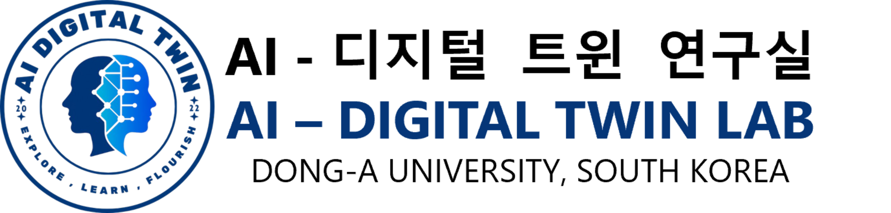

 

# Artificial Intelligence Digital Twin Lab

### AI Digital Twin Lab @ Dong-A University

**Advancing intelligent digital twins through research, innovation, and real-world impact.**

 

  

📍 **Dong-A University · Busan, Republic of Korea**

---

## Welcome to AIDT Lab

The **Artificial Intelligence Digital Twin Lab**, also known as **AIDT Lab**, is a research laboratory at **Dong-A University**.

We conduct research at the intersection of **artificial intelligence** and **digital twin technologies**, developing intelligent methods to understand, represent, simulate, and connect physical environments with their digital counterparts.

Our work combines theoretical research with practical implementation to address real-world challenges through data-driven modeling, spatial intelligence, and intelligent systems.

---

## Research Areas

<table>
  <tr>
    <td width="50%" valign="top">
      <h3>🤖 Artificial Intelligence</h3>
      

        Machine learning, deep learning, intelligent reasoning, and AI-driven decision-support technologies.
      

    </td>
    <td width="50%" valign="top">
      <h3>🏙️ Intelligent Digital Twins</h3>
      

        AI-enabled digital representations, real-time data integration, simulation, and intelligent monitoring of physical environments.
      

    </td>
  </tr>
  <tr>
    <td width="50%" valign="top">
      <h3>🧭 Spatial AI & 3D Intelligence</h3>
      

        Semantic-spatial modeling, 3D building intelligence, scene graphs, spatial knowledge representation, and indoor localization.
      

    </td>
    <td width="50%" valign="top">
      <h3>👁️ Computer Vision</h3>
      

        Visual perception, image understanding, object recognition, spatial localization, and vision-based environmental analysis.
      

    </td>
  </tr>
</table>

---

## What We Do

Our research focuses on building intelligent systems that bridge the gap between the **physical world** and the **digital world**.

We explore:

* AI-driven modeling and simulation
* Semantic and spatial data integration
* Digital twin platforms and applications
* 3D building and urban information modeling
* Computer vision and spatial localization
* Sensor-aware monitoring and data analytics
* Knowledge graphs and graph-based reasoning
* Real-world AI applications across industries

---

## Open Research & Projects

Our GitHub repositories include:

* Research prototypes
* Digital twin platforms
* Spatial intelligence frameworks
* Computer vision implementations
* Data processing and visualization tools
* Demonstration systems and experimental results

Explore our pinned repositories and public projects to learn more about our ongoing research.

---

## Collaboration

We welcome collaboration with:

* Academic researchers
* Undergraduate and graduate students
* Industry partners
* Public institutions
* Open-source contributors

We aim to create meaningful research outcomes by combining interdisciplinary knowledge, advanced technologies, and real-world applications.

### Connect with AIDT Lab

Visit our [official website](https://aidtlab-dau.github.io/) to learn more about our research, members, publications, and recent activities.

 

Artificial Intelligence Digital Twin Lab 
Dong-A University · Busan, Republic of Korea

